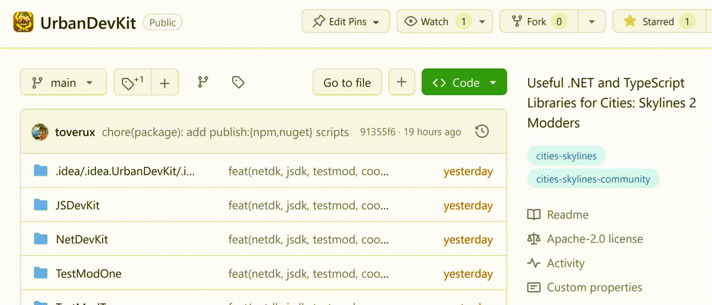

<h1 align="center">:cityscape: UrbanDevKit :hammer_and_wrench:</h1>

<p align="center">
    Common libraries and community patterns for faster Cities: Skylines 2 mods development.
</p>

<p align="center">
    <a title="Join us on Discord!" href="https://discord.gg/SsshDVq2Zj">
        
    </a>
    <a title="Install .NET SDK with NuGet" href="https://www.nuget.org/packages/CitiesSkylinesModding.UrbanDevKit">
        
    </a>
    <a title="Install UI SDK with npm" href="https://www.npmjs.com/package/@csmodding/urbandevkit">
        
    </a>
</p>

> Reference maintainer(s): @toverux<br>
> Contributors: @toverux

## What is UrbanDevKit and why should I use it?

UrbanDevKit (UDK) is a set of two SDKs (UI and .NET) that provide useful utilities and patterns for Cities: Skylines 2 mods.
It is carefully designed to be modular, robust, and as forward and backward compatible as possible.

Let's walk through a few reasons why this approach is better than traditional code sharing or dependency mods.

The often-used approach in C:S 1 was to copy and paste useful code from other mods, but this can become quickly impractical:
 - Hard to track changes and bug fixes (*Who has the best version of that feature? Did someone fix this bug?*).
 - Gives you more maintenance work as you have to track game updates for potential breakages and fix them yourself
 - Clutters your project with third-party code.
 - Forces you to adapt the code when something was not designed to be fully reusable/generic.

Another one was to create a dependency mod, however this has a few drawbacks:
 - If it is broken for one feature (ex. after a game update) and does not load, all mods depending on it are broken.
 - If it is not updated for a new game version, all mods depending on it are stuck.
 - It forces you to update your mod when the dependency receives breaking changes, even if you don't need the new
   features or don't have time to do it, increasing chances for your mod to be broken before its time.
 - Load order/dependencies issues.

An SDK might often be a better solution because:
 - It is included in your mod, so you can control when to update it.<br>
   The .NET SDK is designed so that different mods can use a different, incompatible version, while the UI SDK is
   directly integrated into the final bundle of your mod, and only the features you use thanks to
   [tree shaking](https://developer.mozilla.org/en-US/docs/Glossary/Tree_shaking) making it potentially very light.
 - If one feature is broken, only the mods using this feature are broken.
 - Being modular, it is easier if you really need so to copy and paste a portion of the SDK's code into your mod and
   adapt it to your needs.
 - Thought for developers, it has superior documentation, examples and testing.

## Features

Features offered by UrbanDevKit (UDK) are covered in the repo's [Wiki](https://github.com/CitiesSkylinesModding/UrbanDevKit/wiki).

Here is however a quick overview of features provided by UrbanDevKit:

### .NET-only Features

- **[Shared State](https://github.com/CitiesSkylinesModding/UrbanDevKit/wiki/Shared-State)**
  Share state between assemblies without linking
- **[Coroutine Runner](https://github.com/CitiesSkylinesModding/UrbanDevKit/wiki/Coroutine-Runner)**
  Helper to start coroutines from anywhere or wrap them into Tasks.

### UI-only Features

- **[`cs2/*` Types as a Dependency](https://github.com/CitiesSkylinesModding/UrbanDevKit/wiki/CS2-UI-Types-as-a-Dependency)**
  Get rid of that `types/` folder from your codebase.

### .NET+UI Features

- **[Cooperative Preloading](https://github.com/CitiesSkylinesModding/UrbanDevKit/wiki/Cooperative-Preloading)**
  Prevent the user to load a game while mods are preloading

## Installation

Depending on the features you want to use, you will need to install the .NET SDK, the UI SDK, or both.<br>
Each documentation page informs you about what SDK you need to install and the eventual additional configuration steps.

The .NET SDK is available as a NuGet package: [CitiesSkylinesModding.UrbanDevKit](https://www.nuget.org/packages/CitiesSkylinesModding.UrbanDevKit).
<br>
C# IDEs like Rider or Visual Studio also typically have a GUI client for managing NuGet packages.

```sh
dotnet add package CitiesSkylinesModding.UrbanDevKit
```

The UI SDK is available as a npm package: [@csmodding/urbandevkit](https://www.npmjs.com/package/@csmodding/urbandevkit).
<br>
Your IDE might also have a GUI client!

```sh
npm install @csmodding/urbandevkit
```

And a final tip: get notified of new features and bugfixes by watching for Releases!

<p align="center">
    
</p>

## Development & Contributing

**These are instructions for modifying and building the UrbanDevKit modding libraries,
not the usage documentation of the libraries which is described above.**

> You have a cool snippet you think might be useful to other modders?
> Please open a PR or even join the project on our Discord!

Development Guides are maintained on the repo's [Wiki](https://github.com/CitiesSkylinesModding/UrbanDevKit/wiki) as well, but here's a quick access to development pages:

- **[Installing & Building UrbanDevKit](https://github.com/CitiesSkylinesModding/UrbanDevKit/wiki/Installing-&-Building-UrbanDevKit)**
- **[Code Style](https://github.com/CitiesSkylinesModding/UrbanDevKit/wiki/Code-Style)**
- [Publishing Packages](https://github.com/CitiesSkylinesModding/UrbanDevKit/wiki/Publishing-Packages)
